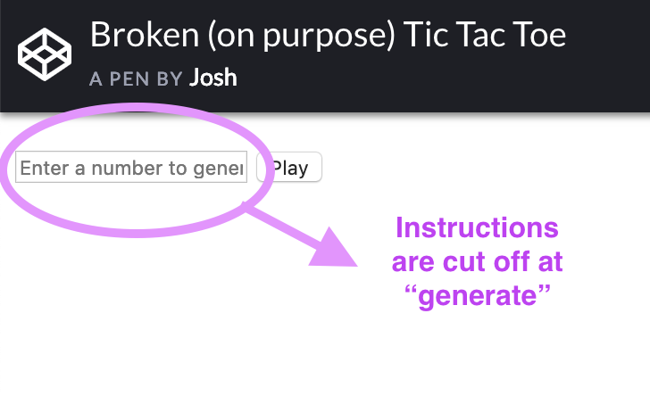
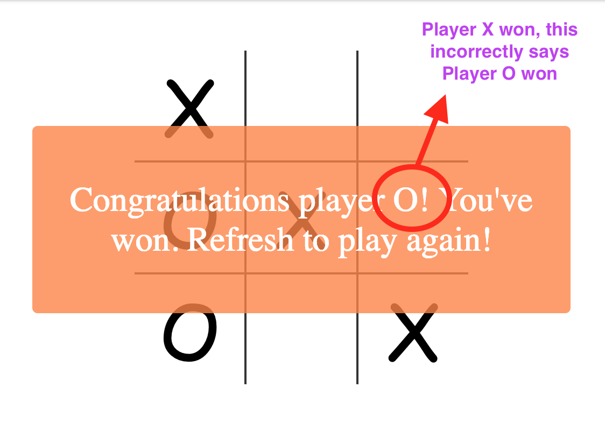
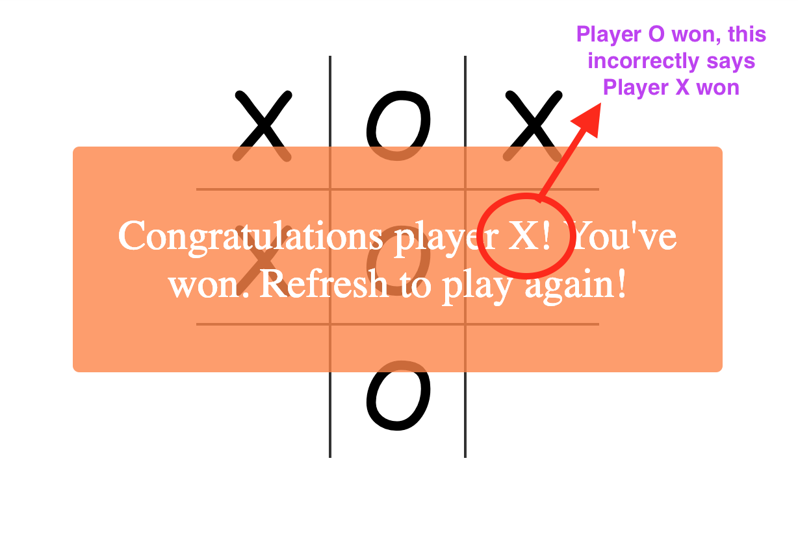
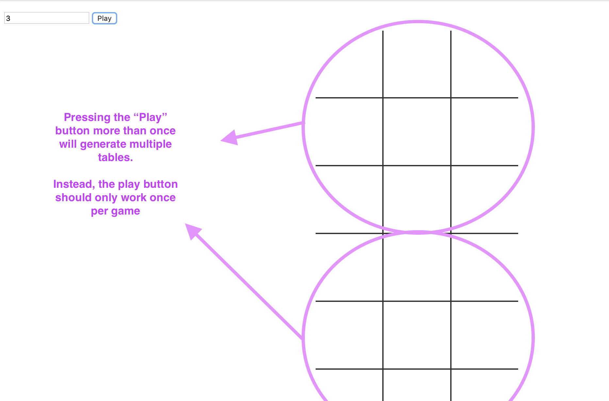
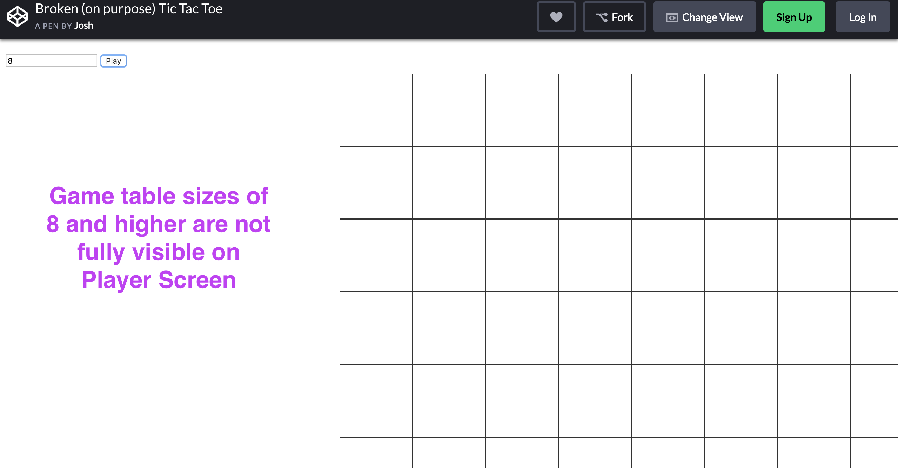

# TicTacToeTests
Automated testing of a broken Tic Tac Toe game on Codepen

**Link to Manual Test Document in Google Docs:** <https://docs.google.com/document/d/1arBrunKxoYdLfbxZril262yWdsHxChsFOio2rw2BWV0/edit?usp=sharing>  

## Project Description

The goal of this project was to create a few automated regression tests. I wrote three automated tests to verify the following questions:

Can the user start a new game?
Can the user enter the first play in the game?
Can Player 1 win the game?

## Technologies Used

  * Frameworks - Eclipse, Selenium, TestNG, Maven
  * Languages - Java
  * Demo #1 - Youtube - [Youtube](https://www.youtube.com/watch?v=xjFEI_3n1S4)
  * Demo #2 - Youtube - [Youtube](https://www.youtube.com/watch?v=tUFy6iV-wCg)

## Quick Glance - Bug Screenshots

View entire Manual Test Document (linked above) for each bug's description, desired functionality, steps to reproduce, and suggestions.

## Additions to a Future Version of Project

  * Negative Tests
  * Tests for Player 2
